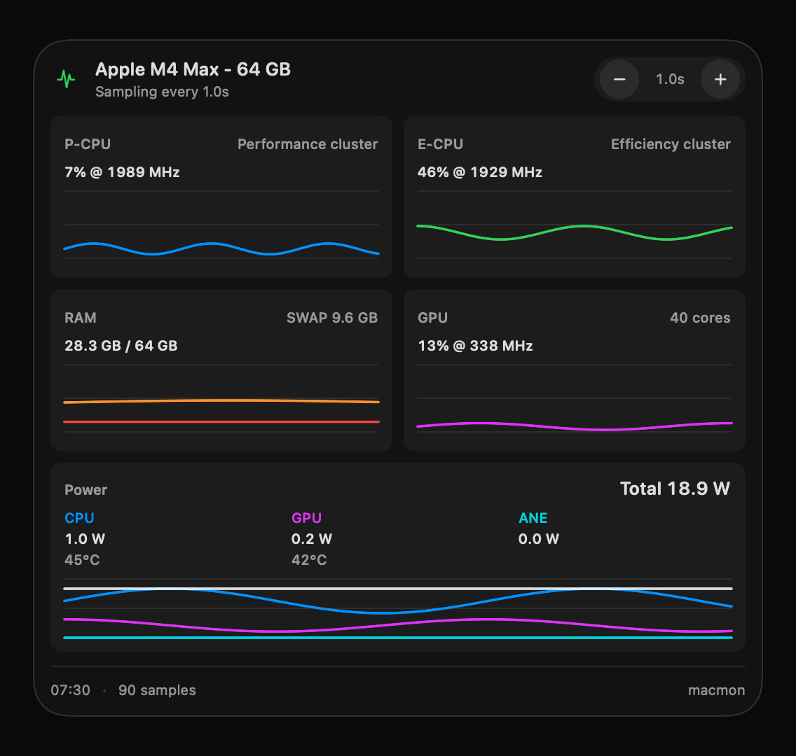

# Macmon Bar

Macmon Bar is a native macOS menu bar monitor for Apple Silicon Macs. It wraps
the open-source [`macmon`](https://github.com/vladkens/macmon) sampler and
shows live CPU, GPU, memory, and power metrics directly in the menu bar.



## Features

- Live menu bar text and graph display
- Configurable menu bar metrics: CPU total, P-CPU, E-CPU, GPU, memory, power,
  CPU power, and GPU power
- Compact value-over-time charts in the popover
- Sampling interval controls with immediate feedback
- Background sampling at 1s, with faster sampling available while the popover
  is open
- Bundled `macmon` binary, so users do not need to install a separate CLI

## Requirements

- macOS 14 or newer
- Apple Silicon Mac

## Install From a Release

For the first GitHub release, Macmon Bar will ship as a signed and notarized zip:

```text
MacmonBar-0.1.0.zip
```

Download the zip from GitHub Releases, unzip it, and move `MacmonBar.app` to
`/Applications`.

## Build Locally

Clone with submodules:

```sh
git clone --recurse-submodules <repo-url>
cd Macmon
```

Build and run the app:

```sh
cd MacmonBar
make app
open dist/MacmonBar.app
```

Development commands:

```sh
make test
make run
make app
```

## Release Versioning

Macmon Bar uses semantic versions: `MAJOR.MINOR.PATCH`.

- Patch: increment by 1 for small fixes, visual polish, performance tweaks,
  dependency updates, or release-process fixes that do not materially change the
  product surface. Example: `0.1.0` -> `0.1.1`.
- Minor: increment for larger UI changes, new settings, new visible metrics, or
  meaningful feature additions. Reset patch to 0. Example: `0.1.3` -> `0.2.0`.
- Major: increment only after explicit maintainer confirmation. Use this for
  breaking changes, major architecture changes, a major minimum macOS version
  change, or a product direction reset.

`CFBundleVersion` is the build number and should increase by 1 for every public
release, regardless of whether the semantic version changes by patch, minor, or
major.

## Signing and Release

Release signing is documented in [RELEASING.md](RELEASING.md). In short:

1. Build the app bundle.
2. Sign the bundled `macmon` binary and then `MacmonBar.app` with a Developer ID
   Application certificate.
3. Notarize the signed app with Apple's notary service.
4. Staple the notarization ticket.
5. Create a zip and upload it to GitHub Releases.

## License

Macmon Bar is released under the MIT License. See [LICENSE](LICENSE).

Macmon Bar bundles the upstream `macmon` binary, which is also licensed under
MIT. See [THIRD_PARTY_NOTICES.md](THIRD_PARTY_NOTICES.md).
