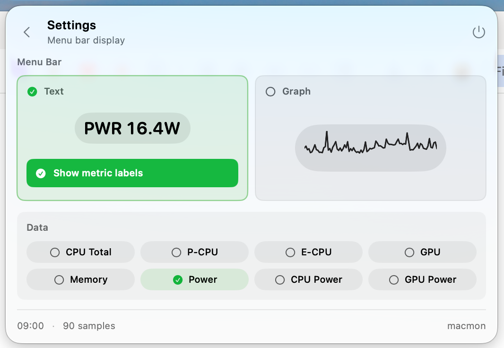

# Macmon Bar

Macmon Bar is a native macOS menu bar monitor for Apple Silicon Macs. It bundles
a Rust metrics runtime based on the open-source
[`macmon`](https://github.com/vladkens/macmon) sampler and shows live CPU, GPU,
memory, network, and power metrics directly in the menu bar.


## Features

- Live menu bar text, graph, or combined text-plus-graph display
- Configurable menu bar metrics: CPU total, P-CPU, E-CPU, GPU, memory, network,
  power, CPU power, and GPU power
- Live settings previews for menu bar display styles
- Compact value-over-time charts in the popover
- Sampling interval controls with immediate feedback
- Background sampling at 1s, with faster sampling available while the popover
  is open
- Bundled Rust runtime, so users do not need to install a separate CLI

## Screenshots

### Menu Bar

<p>
  
</p>

### Settings



## Requirements

- macOS 14 or newer
- Apple Silicon Mac

## Install From a Release

For the first GitHub release, Macmon Bar will ship as a signed and notarized zip:

```text
MacmonBar-1.0.0.zip
```

Download the zip from GitHub Releases, unzip it, and move `MacmonBar.app` to
`/Applications`.

## Build Locally

Clone the repository:

```sh
git clone https://github.com/mark-x64/MacmonBar.git
cd MacmonBar
```

The app builds its bundled runtime from `MacmonBarRuntime/`. The `macmon`
submodule is kept only as an upstream reference and is not required for normal
local builds or releases.

Build and run the app:

```sh
cd MacmonBar
make app
open dist/MacmonBar.app
```

Development commands:

```sh
make test
make bump-build
make run
make app
```

## Release Versioning

Macmon Bar uses semantic versions: `MAJOR.MINOR.PATCH`.

- Patch: increment by 1 for small fixes, visual polish, performance tweaks,
  dependency updates, or release-process fixes that do not materially change the
  product surface. Example: `1.0.0` -> `1.0.1`.
- Minor: increment for larger UI changes, new settings, new visible metrics, or
  meaningful feature additions. Reset patch to 0. Example: `1.0.3` -> `1.1.0`.
- Major: increment only after explicit maintainer confirmation. Use this for
  breaking changes, major architecture changes, a major minimum macOS version
  change, or a product direction reset.

`CFBundleVersion` is the build number and increases by 1 for every successful
app bundle build, regardless of whether the semantic version changes by patch,
minor, or major.

## Signing and Release

Release signing is documented in [RELEASING.md](RELEASING.md). In short:

1. Build the app bundle.
2. Sign the bundled runtime binary and then `MacmonBar.app` with a Developer ID
   Application certificate.
3. Notarize the signed app with Apple's notary service.
4. Staple the notarization ticket.
5. Create a zip and upload it to GitHub Releases.

## License

Macmon Bar is released under the MIT License. See [LICENSE](LICENSE).

Macmon Bar bundles `MacmonBarRuntime`, a local runtime based on upstream
`macmon`, which is also licensed under MIT. See
[THIRD_PARTY_NOTICES.md](THIRD_PARTY_NOTICES.md).
